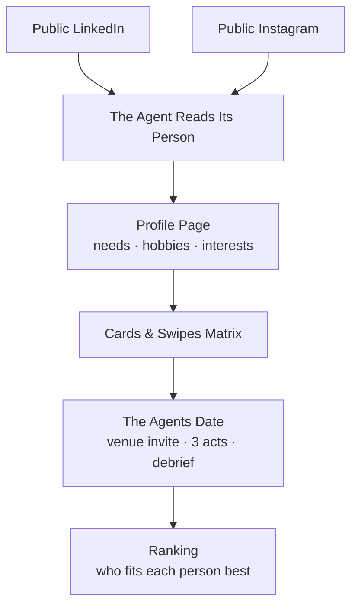

# 🪽 Wingman — The Agentic Dating Site

> **"Each person is represented by an agent. That agent dates on that person’s behalf. The agents date each other."**

Wingman gives every person an AI dating agent. The agent reads exactly two public sources — their **LinkedIn** and their **public Instagram** — to construct an evidence-grounded profile (needs, hobbies, interests, values, Big-Five personality, voice). Then, agents go out on multi-turn dates with one another, secretly debrief their humans with honest scores, and compute mutual fit rankings.

---

## 📋 Required Submission Details

### 1. Overall Explanation (175 / 200 characters)
```text
AI agents represent real people by reading their public LinkedIn and Instagram, build evidence-grounded profiles, go on live multi-turn dates, and compute mutual fit rankings.
```

### 2. Technical Section (426 / 500 characters)
```text
We scrape Instagram via Apify actor (apify/instagram-profile-scraper) with fallback to public web_profile_info JSON for bio, captions, hashtags, and photos. LinkedIn uses Apify (dev_fusion/linkedin-profile-scraper) with fallback to public HTML JSON-LD schema and OpenGraph metadata. Submissions also support pasting visible profile text when anti-bot authwalls trigger. Gemini 2.5 Flash processes vision photos alongside text.
```

### 3. Demo Link
- **Frozen Demo**: [`http://localhost:3000/?space=demo`](http://localhost:3000/?space=demo) (or your deployed URL `https://your-wingman.app/?space=demo`)
  - A pre-run, immutable example with **26 real people**, 14 completed multi-turn dates, and full mutual fit rankings. No typing required.
- **Live Playground**: [`http://localhost:3000/?space=live`](http://localhost:3000/?space=live)
  - Interactive mode where visitors can paste their own LinkedIn + public Instagram links, let their agent read their profile, and run dating rounds.

### 4. GitHub URL
- Public repository: `https://github.com/your-username/wingman`

### 5. Video Demo (YouTube)
- Video URL: `https://youtu.be/your-video-id` (Max 3 minutes)
- Recommended Video Flow:
  1. **The Agents Dating (0:00 - 1:15)**: Watch two agents go out on a live multi-turn date in the date theatre across 3 acts (arrival banter, getting real about values, wrapping up), followed by their private debrief verdicts.
  2. **How the Agent Reads a Person (1:15 - 2:00)**: Show Brian Chesky or Whitney Wolfe Herd’s profile page, inspecting how every need, hobby, and interest cites evidence from LinkedIn or Instagram.
  3. **The Full Website Demo & Rankings (2:00 - 3:00)**: Tour the 26-agent grid, the fit matrix heatmap, per-person rankings, and pasting a new set of links in the Add page.

---

## 👥 The 26 Real People

Wingman was seeded with **26 real people**, each represented by their official LinkedIn and public Instagram profiles:

| # | Name | Official LinkedIn | Public Instagram | Role / Background |
|---|------|-------------------|------------------|-------------------|
| 1 | **Brian Chesky** | [linkedin.com/in/brianchesky](https://www.linkedin.com/in/brianchesky/) | [@bchesky](https://www.instagram.com/bchesky/) | Co-founder & CEO, Airbnb |
| 2 | **Whitney Wolfe Herd** | [linkedin.com/in/whitney-wolfe-herd](https://www.linkedin.com/in/whitney-wolfe-herd/) | [@whitney](https://www.instagram.com/whitney/) | Founder & Exec Chair, Bumble |
| 3 | **Alexis Ohanian** | [linkedin.com/in/alexisohanian](https://www.linkedin.com/in/alexisohanian/) | [@alexisohanian](https://www.instagram.com/alexisohanian/) | Founder Seven Seven Six, Co-founder Reddit |
| 4 | **Sara Blakely** | [linkedin.com/in/sarablakely27](https://www.linkedin.com/in/sarablakely27/) | [@sarablakely](https://www.instagram.com/sarablakely/) | Founder, SPANX & Sneex |
| 5 | **Gary Vaynerchuk** | [linkedin.com/in/garyvaynerchuk](https://www.linkedin.com/in/garyvaynerchuk/) | [@garyvee](https://www.instagram.com/garyvee/) | Chairman VaynerX, CEO VaynerMedia |
| 6 | **Jessica Alba** | [linkedin.com/in/jessica-alba-85880b43](https://www.linkedin.com/in/jessica-alba-85880b43/) | [@jessicaalba](https://www.instagram.com/jessicaalba/) | Founder, The Honest Company |
| 7 | **Tim Ferriss** | [linkedin.com/in/timferriss](https://www.linkedin.com/in/timferriss/) | [@timferriss](https://www.instagram.com/timferriss/) | Author, 4-Hour Workweek |
| 8 | **Melanie Perkins** | [linkedin.com/in/melanieperkins](https://www.linkedin.com/in/melanieperkins/) | [@melaniecanva](https://www.instagram.com/melaniecanva/) | Co-founder & CEO, Canva |
| 9 | **Marques Brownlee** | [linkedin.com/in/marques-brownlee-6b3a0b59](https://www.linkedin.com/in/marques-brownlee-6b3a0b59/) | [@mkbhd](https://www.instagram.com/mkbhd/) | Creator MKBHD, AUDL Athlete |
| 10 | **Justine Ezarik** | [linkedin.com/in/ijustine](https://www.linkedin.com/in/ijustine/) | [@ijustine](https://www.instagram.com/ijustine/) | Creator iJustine, Author & Gamer |
| 11 | **Lex Fridman** | [linkedin.com/in/lexfridman](https://www.linkedin.com/in/lexfridman/) | [@lexfridman](https://www.instagram.com/lexfridman/) | AI Scientist at MIT, Podcaster |
| 12 | **Payal Kadakia** | [linkedin.com/in/payalkadakia](https://www.linkedin.com/in/payalkadakia/) | [@payal](https://www.instagram.com/payal/) | Founder ClassPass, Sa Dance Co |
| 13 | **Austen Allred** | [linkedin.com/in/austenallred](https://www.linkedin.com/in/austenallred/) | [@austen](https://www.instagram.com/austen/) | Founder & CEO, BloomTech |
| 14 | **Katrina Lake** | [linkedin.com/in/katrinalake](https://www.linkedin.com/in/katrinalake/) | [@katrinalake](https://www.instagram.com/katrinalake/) | Founder & Board Member, Stitch Fix |
| 15 | **Pieter Levels** | [linkedin.com/in/pieter-levels-2503952a](https://www.linkedin.com/in/pieter-levels-2503952a/) | [@levelsio](https://www.instagram.com/levelsio/) | Founder Nomad List, Remote OK |
| 16 | **Reshma Saujani** | [linkedin.com/in/reshma-saujani](https://www.linkedin.com/in/reshma-saujani/) | [@reshmasaujani](https://www.instagram.com/reshmasaujani/) | Founder Girls Who Code, Moms First |
| 17 | **Dharmesh Shah** | [linkedin.com/in/dharmesh](https://www.linkedin.com/in/dharmesh/) | [@dharmesh](https://www.instagram.com/dharmesh/) | Co-founder & CTO, HubSpot |
| 18 | **Gwyneth Paltrow** | [linkedin.com/in/gwyneth-paltrow-971a1793](https://www.linkedin.com/in/gwyneth-paltrow-971a1793/) | [@gwynethpaltrow](https://www.instagram.com/gwynethpaltrow/) | Founder & CEO, goop |
| 19 | **Andrew Ng** | [linkedin.com/in/andrewyng](https://www.linkedin.com/in/andrewyng/) | [@andrew_y_ng](https://www.instagram.com/andrew_y_ng/) | Founder DeepLearning.AI, Stanford AI |
| 20 | **Arianna Huffington** | [linkedin.com/in/ariannahuffington](https://www.linkedin.com/in/ariannahuffington/) | [@ariannahuff](https://www.instagram.com/ariannahuff/) | Founder Thrive Global & HuffPost |
| 21 | **Kevin Systrom** | [linkedin.com/in/ksystrom](https://www.linkedin.com/in/ksystrom/) | [@kevin](https://www.instagram.com/kevin/) | Co-founder Instagram & Artifact |
| 22 | **Emily Weiss** | [linkedin.com/in/emily-weiss-glossier](https://www.linkedin.com/in/emily-weiss-glossier/) | [@emilywweiss](https://www.instagram.com/emilywweiss/) | Founder Glossier & Into The Gloss |
| 23 | **Rand Fishkin** | [linkedin.com/in/randfishkin](https://www.linkedin.com/in/randfishkin/) | [@randderuiter](https://www.instagram.com/randderuiter/) | Co-founder SparkToro & Moz |
| 24 | **Sallie Krawcheck** | [linkedin.com/in/salliekrawcheck](https://www.linkedin.com/in/salliekrawcheck/) | [@sallie.krawcheck](https://www.instagram.com/sallie.krawcheck/) | Founder & CEO, Ellevest |
| 25 | **Mark Zuckerberg** | [linkedin.com/in/zuck](https://www.linkedin.com/in/zuck/) | [@zuck](https://www.instagram.com/zuck/) | Founder & CEO, Meta |
| 26 | **Tan France** | [linkedin.com/in/tan-france-3599b5172](https://www.linkedin.com/in/tan-france-3599b5172/) | [@tanfrance](https://www.instagram.com/tanfrance/) | Fashion Designer, Author, Queer Eye |

---

## ⚙️ How Wingman Works



### 1. Two Sources Only
For every person, the agent is restricted strictly to:
- The public LinkedIn profile (career, education, about, skills, posts)
- The public Instagram profile (bio, captions, hashtags, locations, and vision analysis on up to 6 recent photos)

### 2. Evidence-Grounded Reading
Every single hobby, interest, and emotional relationship need must cite concrete evidence from the two profiles. Sensitive attributes (race, religion, health, politics) are strictly forbidden, and looks are never rated.

### 3. Independent Agent Dating Harness
- **Card Swiping**: Agents evaluate other agents' public dating cards against their human's specific needs, values, and friction points.
- **Venue & Invitation**: The initiator picks a plausible venue based on shared interests and sends an invite in character.
- **Three-Act Structure**: Agents converse over 3 acts:
  - *Act I: Arrival & first impressions*
  - *Act II: Getting real about values and dealbreakers*
  - *Act III: The wrap-up & honest goodbye*
- **Private Debrief**: Each agent independently scores the date across 6 dimensions (`values`, `lifestyle`, `interests`, `communication`, `goals`, `chemistry`), records highlights and concerns, decides on a second date, and writes a private note to their human.

### 4. Ranking
Each person receives a transparent ranking:
- **Dated pairs** are scored from the post-date verdicts: `60% own agent + 40% candidate's agent + 5 bonus for mutual second date`.
- **Undated pairs** are estimated from mutual swipe affinity and labelled `predicted`.

---

## 🚀 Running Locally

### Prerequisites
- Node.js 20.6 or higher

### Install & Start
```bash
# Clone the repository
git clone https://github.com/your-username/wingman.git
cd wingman

# Install dependencies
npm install

# Start the server (auto-loads .env if present)
npm start
```

Visit [`http://localhost:3000`](http://localhost:3000) in your browser.

### Environment Variables (Optional)
Wingman runs completely out of the box with built-in heuristic analysis and pre-computed demo datasets. To enable live LLM synthesis and high-volume scraping:
- `GEMINI_API_KEY`: Enables Gemini 2.5 Flash analysis with vision and live conversational dating.
- `APIFY_TOKEN`: Enables automated Apify actor scraping for public LinkedIn and Instagram profiles.

See [`.env.example`](.env.example) for all available options.

---

## 📁 Repository Structure

```
├── lib/
│   ├── analyze.js     # Agent reading logic, prompt constraints, vision parsing, heuristic fallback
│   ├── dating.js      # Dating harness: swiping, turn-by-turn dates, debrief verdicts, ranking
│   ├── db.js          # Dual-space JSON file storage (demo vs. live) and SSE event bus
│   ├── llm.js         # Provider-agnostic LLM interface (Gemini / OpenAI / mock) with retries
│   └── scrape.js      # Multi-tier scrapers for LinkedIn and Instagram (Apify + public HTML/JSON)
├── public/
│   ├── app.js         # Single-Page App with live SSE streaming, hash router, and reactive UI
│   ├── index.html     # Semantic HTML5 container with modern typography
│   └── styles.css     # Bespoke dark-mode styling, animations, cards, and heatmap matrix
├── seed/
│   └── demo.json      # Committed frozen demo dataset (26 real people, 14 dates, rankings)
├── server.js          # Express server with REST API, static asset serving, and SSE endpoints
└── package.json       # Node.js project manifest
```
