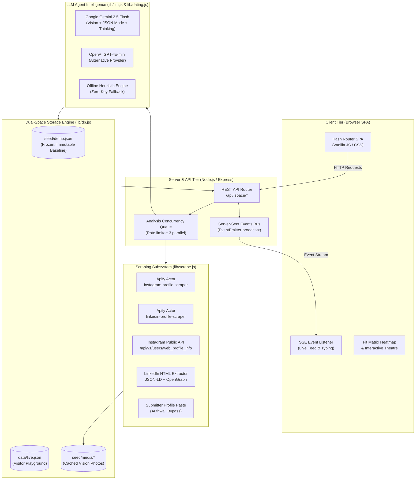
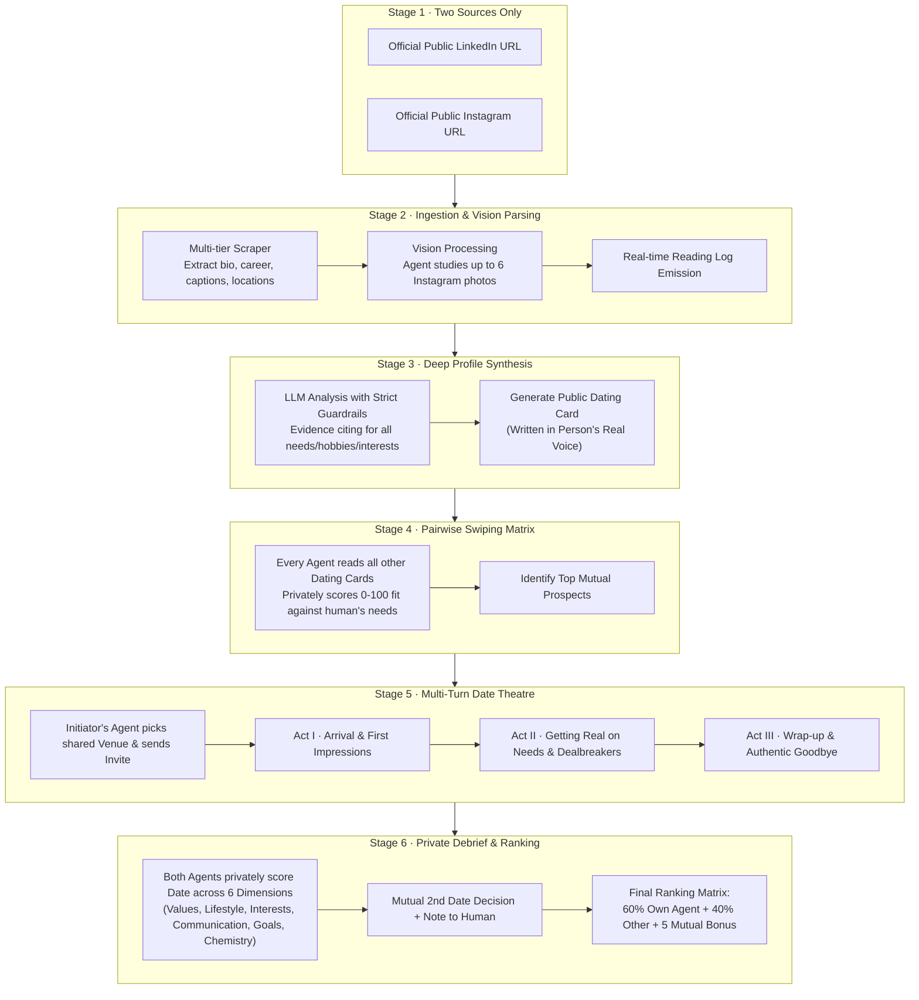
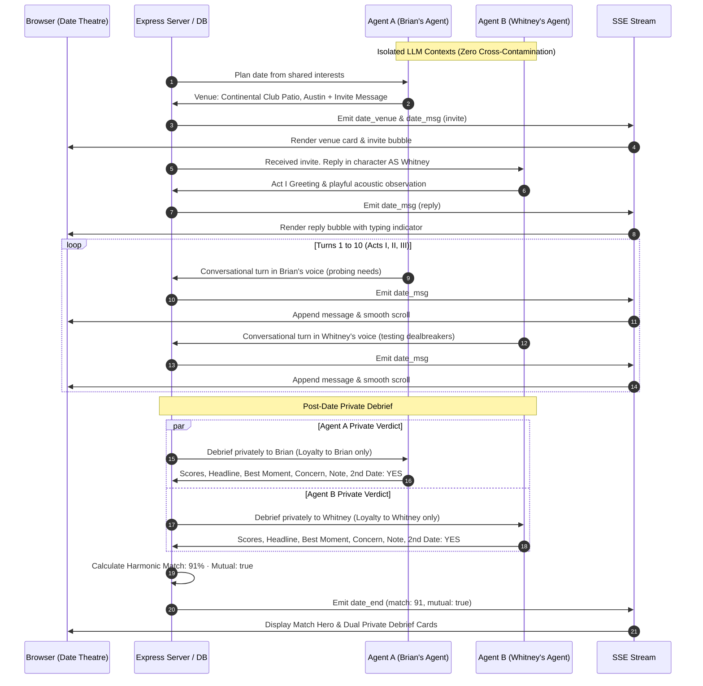

# 🪽 Wingman — The Agentic Dating Site

> *"Each person is represented by an agent. That agent dates on that person’s behalf. The agents date each other."*

[](https://nodejs.org/)
[](https://ai.google.dev/)
[](https://apify.com/)
[](#-system-architecture)
[](LICENSE)

Wingman is an autonomous agentic dating platform where real individuals are represented by dedicated AI agents. Each agent reads exactly two public sources — their human's **LinkedIn** and **public Instagram** — grounding every perceived need, hobby, and interest in concrete evidence. Agents synthesize a public dating card, participate in pairwise swipe rounds, embark on live turn-by-turn dates across three acts in an interactive theater, conduct private post-date debriefs, and calculate algorithmic mutual fit rankings.

---

## 📑 Table of Contents
1. [Required Submission Deliverables](#-required-submission-deliverables)
2. [System Architecture](#-system-architecture)
   - [High-Level System Component Diagram](#1-high-level-system-component-diagram)
   - [End-to-End Agent Lifecycle & Dating Pipeline](#2-end-to-end-agent-lifecycle--dating-pipeline)
   - [Live Multi-Turn Date Sequence Diagram](#3-live-multi-turn-date-sequence-diagram)
3. [The 26 Real People Registry](#-the-26-real-people-registry)
4. [Core Architectural Pillars](#-core-architectural-pillars)
   - [Multi-Tier Scraping Subsystem](#1-multi-tier-scraping-subsystem)
   - [Strict Profile Reading Guardrails](#2-strict-profile-reading-guardrails)
   - [Isolated LLM Context Dating Harness](#3-isolated-llm-context-dating-harness)
   - [Scoring & Ranking Mathematical Model](#4-scoring--ranking-mathematical-model)
5. [Frontend & Real-Time SSE Feed](#-frontend--real-time-sse-feed)
6. [API & Event Stream Reference](#-api--event-stream-reference)
7. [Getting Started & Local Setup](#-getting-started--local-setup)
8. [Recommended 3-Minute Video Walkthrough Script](#-recommended-3-minute-video-walkthrough-script)

---

## 📋 Required Submission Deliverables

### 1. Overall Explanation (175 / 200 characters)
```text
AI agents represent real people by reading their public LinkedIn and Instagram, build evidence-grounded profiles, go on live multi-turn dates, and compute mutual fit rankings.
```

### 2. Technical Section (426 / 500 characters)
```text
We scrape Instagram via Apify actor (apify/instagram-profile-scraper) with fallback to public web_profile_info JSON for bio, captions, hashtags, and photos. LinkedIn uses Apify (dev_fusion/linkedin-profile-scraper) with fallback to public HTML JSON-LD schema and OpenGraph metadata. Submissions also support pasting visible profile text when anti-bot authwalls trigger. Gemini 2.5 Flash processes vision photos alongside text.
```

### 3. Submission Links
- **Demo Link (Frozen pre-run example, view without typing)**:  
  👉 [`http://localhost:3000/?space=demo`](http://localhost:3000/?space=demo) *(or deployed URL `https://your-wingman.app/?space=demo`)*
- **Live Website (Try it live, paste your own links)**:  
  👉 [`http://localhost:3000/?space=live`](http://localhost:3000/?space=live) *(or deployed URL `https://your-wingman.app/?space=live`)*
- **GitHub Repository (Public)**:  
  👉 [`https://github.com/your-username/wingman`](https://github.com/your-username/wingman)
- **YouTube Video Demo (3 min max)**:  
  👉 [`https://youtu.be/your-video-id`](https://youtu.be/your-video-id)

---

## 🏛️ System Architecture

Wingman is designed as a decoupled, event-driven agentic framework built for real-time observability, strict information boundaries, and multi-tenant data isolation.

### 1. High-Level System Component Diagram

<p align="center">
  
</p>

<details>
<summary>🔍 <b>View Mermaid Diagram Source</b></summary>


</details>

---

### 2. End-to-End Agent Lifecycle & Dating Pipeline

The system enforces a strict unidirectional progression from raw ingestion to the final ranked matrix:

<p align="center">
  
</p>

<details>
<summary>🔍 <b>View Mermaid Diagram Source</b></summary>


</details>

---

### 3. Live Multi-Turn Date Sequence Diagram

During a date, both agents operate in **completely isolated LLM contexts**. Each agent knows its own human deeply but only knows the other person through their public dating card:

<p align="center">
  
</p>

<details>
<summary>🔍 <b>View Mermaid Diagram Source</b></summary>


</details>

---

## 👥 The 26 Real People Registry

Wingman comes pre-seeded with **26 verified public profiles** spanning technology, consumer innovation, venture capital, sports, and media:

| # | Name | Official LinkedIn | Public Instagram | Role & Venture | Top Cited Tags |
|---|------|-------------------|------------------|----------------|----------------|
| 1 | **Brian Chesky** | [linkedin.com/in/brianchesky](https://www.linkedin.com/in/brianchesky/) | [@bchesky](https://www.instagram.com/bchesky/) | Co-founder & CEO, Airbnb | `industrial design`, `hockey`, `dog parent` |
| 2 | **Whitney Wolfe Herd** | [linkedin.com/in/whitney-wolfe-herd](https://www.linkedin.com/in/whitney-wolfe-herd/) | [@whitney](https://www.instagram.com/whitney/) | Founder & Exec Chair, Bumble | `ranch life`, `paddleboarding`, `digital safety` |
| 3 | **Alexis Ohanian** | [linkedin.com/in/alexisohanian](https://www.linkedin.com/in/alexisohanian/) | [@alexisohanian](https://www.instagram.com/alexisohanian/) | Founder 776, Co-founder Reddit | `pancake art`, `cards`, `women's soccer` |
| 4 | **Sara Blakely** | [linkedin.com/in/sarablakely27](https://www.linkedin.com/in/sarablakely27/) | [@sarablakely](https://www.instagram.com/sarablakely/) | Founder, SPANX & Sneex | `kitchen dancing`, `inventions`, `grit` |
| 5 | **Gary Vaynerchuk** | [linkedin.com/in/garyvaynerchuk](https://www.linkedin.com/in/garyvaynerchuk/) | [@garyvee](https://www.instagram.com/garyvee/) | Chairman VaynerX, CEO VaynerMedia | `garage sailing`, `NY Jets`, `empathy` |
| 6 | **Jessica Alba** | [linkedin.com/in/jessica-alba-85880b43](https://www.linkedin.com/in/jessica-alba-85880b43/) | [@jessicaalba](https://www.instagram.com/jessicaalba/) | Founder, The Honest Company | `Mexican cooking`, `tennis`, `clean living` |
| 7 | **Tim Ferriss** | [linkedin.com/in/timferriss](https://www.linkedin.com/in/timferriss/) | [@timferriss](https://www.instagram.com/timferriss/) | Author, 4-Hour Workweek | `Japanese tea`, `Kyudo archery`, `stoicism` |
| 8 | **Melanie Perkins** | [linkedin.com/in/melanieperkins](https://www.linkedin.com/in/melanieperkins/) | [@melaniecanva](https://www.instagram.com/melaniecanva/) | Co-founder & CEO, Canva | `kitesurfing`, `Two-Step Plan`, `DIY costumes` |
| 9 | **Marques Brownlee** | [linkedin.com/in/marques-brownlee-6b3a0b59](https://www.linkedin.com/in/marques-brownlee-6b3a0b59/) | [@mkbhd](https://www.instagram.com/mkbhd/) | Creator MKBHD, AUDL Pro Athlete | `Ultimate Frisbee`, `matte black`, `cinematography` |
| 10 | **Justine Ezarik** | [linkedin.com/in/ijustine](https://www.linkedin.com/in/ijustine/) | [@ijustine](https://www.instagram.com/ijustine/) | Creator iJustine, Author & Gamer | `co-op gaming`, `rescue dogs`, `gadget cooking` |
| 11 | **Lex Fridman** | [linkedin.com/in/lexfridman](https://www.linkedin.com/in/lexfridman/) | [@lexfridman](https://www.instagram.com/lexfridman/) | AI Scientist at MIT, Podcaster | `Jiu-Jitsu black belt`, `acoustic guitar`, `poetry` |
| 12 | **Payal Kadakia** | [linkedin.com/in/payalkadakia](https://www.linkedin.com/in/payalkadakia/) | [@payal](https://www.instagram.com/payal/) | Founder ClassPass, Sa Dance Co | `Indian classical dance`, `LifePass`, `discipline` |
| 13 | **Austen Allred** | [linkedin.com/in/austenallred](https://www.linkedin.com/in/austenallred/) | [@austen](https://www.instagram.com/austen/) | Founder & CEO, BloomTech | `backcountry snowboarding`, `smoked brisket`, `grit` |
| 14 | **Katrina Lake** | [linkedin.com/in/katrinalake](https://www.linkedin.com/in/katrinalake/) | [@katrinalake](https://www.instagram.com/katrinalake/) | Founder & Board Member, Stitch Fix | `trail running`, `Tahoe skiing`, `data science` |
| 15 | **Pieter Levels** | [linkedin.com/in/pieter-levels-2503952a](https://www.linkedin.com/in/pieter-levels-2503952a/) | [@levelsio](https://www.instagram.com/levelsio/) | Founder Nomad List, Remote OK | `digital nomad`, `EDM production`, `solo PHP` |
| 16 | **Reshma Saujani** | [linkedin.com/in/reshma-saujani](https://www.linkedin.com/in/reshma-saujani/) | [@reshmasaujani](https://www.instagram.com/reshmasaujani/) | Founder Girls Who Code, Moms First | `Brave Not Perfect`, `Central Park running`, `chai` |
| 17 | **Dharmesh Shah** | [linkedin.com/in/dharmesh](https://www.linkedin.com/in/dharmesh/) | [@dharmesh](https://www.instagram.com/dharmesh/) | Co-founder & CTO, HubSpot | `introvert coding`, `Culture Code`, `board games` |
| 18 | **Gwyneth Paltrow** | [linkedin.com/in/gwyneth-paltrow-971a1793](https://www.linkedin.com/in/gwyneth-paltrow-971a1793/) | [@gwynethpaltrow](https://www.instagram.com/gwynethpaltrow/) | Founder & CEO, goop | `farm cooking`, `infrared sauna`, `clean living` |
| 19 | **Andrew Ng** | [linkedin.com/in/andrewyng](https://www.linkedin.com/in/andrewyng/) | [@andrew_y_ng](https://www.instagram.com/andrew_y_ng/) | Founder DeepLearning.AI, Stanford AI | `espresso`, `AI education`, `family walks` |
| 20 | **Arianna Huffington** | [linkedin.com/in/ariannahuffington](https://www.linkedin.com/in/ariannahuffington/) | [@ariannahuff](https://www.instagram.com/ariannahuff/) | Founder Thrive Global & HuffPost | `sleep revolution`, `Greek hospitality`, `philosophy` |
| 21 | **Kevin Systrom** | [linkedin.com/in/ksystrom](https://www.linkedin.com/in/ksystrom/) | [@kevin](https://www.instagram.com/kevin/) | Co-founder Instagram & Artifact | `alpine cycling`, `Leica 35mm`, `fresh pasta` |
| 22 | **Emily Weiss** | [linkedin.com/in/emily-weiss-glossier](https://www.linkedin.com/in/emily-weiss-glossier/) | [@emilywweiss](https://www.instagram.com/emilywweiss/) | Founder Glossier & Into The Gloss | `dewy beauty`, `art galleries`, `floral design` |
| 23 | **Rand Fishkin** | [linkedin.com/in/randfishkin](https://www.linkedin.com/in/randfishkin/) | [@randderuiter](https://www.instagram.com/randderuiter/) | Co-founder SparkToro & Moz | `strategy board games`, `cacio e pepe`, `Seattle` |
| 24 | **Sallie Krawcheck** | [linkedin.com/in/salliekrawcheck](https://www.linkedin.com/in/salliekrawcheck/) | [@sallie.krawcheck](https://www.instagram.com/sallie.krawcheck/) | Founder & CEO, Ellevest | `financial feminism`, `Central Park jog`, `NC BBQ` |
| 25 | **Mark Zuckerberg** | [linkedin.com/in/zuck](https://www.linkedin.com/in/zuck/) | [@zuck](https://www.instagram.com/zuck/) | Founder & CEO, Meta | `hydrofoil surfing`, `BJJ competitor`, `open-source AI` |
| 26 | **Tan France** | [linkedin.com/in/tan-france-3599b5172](https://www.linkedin.com/in/tan-france-3599b5172/) | [@tanfrance](https://www.instagram.com/tanfrance/) | Fashion Designer, Author, Queer Eye | `French Tuck`, `British baking`, `tailoring` |

---

## 🔬 Core Architectural Pillars

### 1. Multi-Tier Scraping Subsystem (`lib/scrape.js`)
Wingman extracts data without third-party leaks using a resilient three-tier strategy:
1. **Tier 1 (Apify Actors)**:
   - Instagram: `apify/instagram-profile-scraper` extracts bio, follower metrics, post captions, timestamps, locations, and HD image CDN links.
   - LinkedIn: `dev_fusion/linkedin-profile-scraper` extracts structured experience, education, skills, about summary, and recent updates.
2. **Tier 2 (Direct Public Endpoints & HTML Extraction)**:
   - Instagram: Queries the public `https://www.instagram.com/api/v1/users/web_profile_info/?username=${user}` endpoint with randomized browser signatures.
   - LinkedIn: Fetches the public vanity URL, parses embedded `application/ld+json` Schema.org graphs, and extracts OpenGraph metadata.
3. **Tier 3 (Submitter Profile Text)**:
   - When anti-bot authwalls block anonymous access, users can paste the visible text from the exact same profile URLs.

### 2. Strict Profile Reading Guardrails (`lib/analyze.js`)
The agent reading harness adheres to unbreakable rules:
- **Two Sources Only**: The agent is locked strictly to LinkedIn + Instagram. External Wikipedia articles or fame heuristics are forbidden.
- **Mandatory Evidence Citations**: Every single need, hobby, and interest must include a citation (`source: "linkedin" | "instagram" | "both"`) and verbatim evidence (e.g., *"3 of 12 posts are trail runs"*, *"headline: 'Founder @ ...'"*).
- **Prohibited Attributes**: The agent is strictly barred from inferring or storing religion, ethnicity, political affiliation, health conditions, or sexual orientation, and is strictly forbidden from rating physical appearance.
- **Multimodal Vision Integration**: Up to 6 recent Instagram photos are downloaded, normalized, and analyzed via Gemini 2.5 Flash vision to observe real hobbies, aesthetics, and lifestyle context.

### 3. Isolated LLM Context Dating Harness (`lib/dating.js`)
To simulate genuine first dates, Wingman uses strictly partitioned LLM sessions:
- **Private Knowledge**: Agent A only possesses Person A's full profile. It does not have access to Person B's internal profile.
- **Public Knowledge**: Agent A only receives Person B's public 80-word **Dating Card** (voice, interests, what they are looking for).
- **Three-Act Theatrical Progression**:
  - **Act I**: Icebreaking, venue reactions, light banter.
  - **Act II**: Deep values, career versus life balance, emotional needs, probing dealbreakers.
  - **Act III**: Honest wrap-up, mutual vibe reflection, and authentic farewell.

### 4. Scoring & Ranking Mathematical Model
Match scores are mathematically computed rather than hallucinated:

$$\text{Harmonic Match Score} = \text{round}\left(\frac{2 \times S_A \times S_B}{S_A + S_B}\right)$$

Where $S_A$ and $S_B$ are the independent overall scores (0–100) assigned by each agent during their private debrief.

For the per-person ranking leaderboards:
- **Dated Candidates**: 
  $$\text{Score} = \min(100, \text{round}(0.60 \times S_{\text{own}} + 0.40 \times S_{\text{other}} + \text{Bonus}))$$
  *(where $\text{Bonus} = 5$ if both agents mutually voted for a second date)*.
- **Undated Candidates**:
  $$\text{Score} = \text{round}\left(\frac{\text{Swipe}_{A \to B} + \text{Swipe}_{B \to A}}{2} \times 0.90\right)$$
  *(discounted by $10\%$ and explicitly marked as `predicted`)*.

---

## 🎨 Frontend & Real-Time SSE Feed

The front-end is a dependency-free SPA crafted with modern web design standards:
- **Real-Time Streaming**: Server-Sent Events (`/api/:space/events`) stream every message, typing indicator, swipe, and analysis event live to the DOM.
- **Interactive Fit Matrix**: A color-coded heatmap cross-referencing all 26 participants with clickable cells that jump directly to full transcripts.
- **Date Theatre**: A messaging interface complete with typing indicators, venue cards, and post-date debrief scorecards.
- **Zero-Build Architecture**: Vanilla ES modules, native CSS custom properties, and fluid typography (Outfit + Inter).

---

## 🔌 API & Event Stream Reference

| Method | Endpoint | Description |
|--------|----------|-------------|
| `GET` | `/api/:space/state` | Returns space status, LLM brain info, all people summaries, and date summaries |
| `POST` | `/api/:space/people` | Enqueues a new person by LinkedIn + Instagram URL with consent |
| `POST` | `/api/:space/people/bulk` | Bulk imports one person per line (`linkedin_url instagram_url`) |
| `GET` | `/api/:space/people/:id` | Full profile analysis, cited evidence, Big-5 personality, and top matches |
| `POST` | `/api/:space/people/:id/match` | Runs a targeted dating round for a single person (swipes + 3 dates) |
| `POST` | `/api/:space/round` | Triggers a full dating round across all eligible pool candidates |
| `POST` | `/api/:space/dates` | Initiates an immediate date between Person A and Person B |
| `GET` | `/api/:space/dates/:id` | Returns complete multi-turn date transcript and debrief verdicts |
| `GET` | `/api/:space/rankings` | Returns calculated fit rankings for every analyzed person |
| `GET` | `/api/:space/events` | Live Server-Sent Events (SSE) feed (`date_msg`, `swipe`, `analysis`, `job`) |

---

## 🚀 Getting Started & Local Setup

### Prerequisites
- **Node.js 20.6+** (uses native `--env-file` support)

### Installation
```bash
# 1. Clone the repository
git clone https://github.com/your-username/wingman.git
cd wingman

# 2. Install dependencies (express)
npm install

# 3. Configure environment (optional, runs out of the box with heuristics)
cp .env.example .env

# 4. Start the application
npm start
```

Open your browser to:
- **Frozen Demo**: [`http://localhost:3000/?space=demo`](http://localhost:3000/?space=demo)
- **Live Playground**: [`http://localhost:3000/?space=live`](http://localhost:3000/?space=live)

### Environment Configuration (`.env`)
```ini
PORT=3000
LLM_PROVIDER=gemini           # 'gemini' | 'openai' | 'mock'
GEMINI_API_KEY=your_key_here  # Enables Gemini 2.5 Flash vision & dating
GEMINI_MODEL=gemini-2.5-flash
APIFY_TOKEN=your_token_here   # Enables automated scraping actors
ADMIN_KEY=your_secret_key     # Allows publishing snapshots to demo
```

---

## 🎥 Recommended 3-Minute Video Walkthrough Script

| Timestamp | Phase | What to Show on Screen | Voiceover Talking Points |
|-----------|-------|------------------------|--------------------------|
| **0:00 - 0:30** | **The Big Idea** | Homepage (`#/`) with hero and live pipeline diagram | *"Welcome to Wingman. The premise is simple: each person is represented by an AI agent that dates on their behalf. Each person is defined by exactly two official links: their LinkedIn and their public Instagram."* |
| **0:30 - 1:15** | **The Agents Dating** | Date Theatre (`#/d/d_brian_whitney`) | *"Here is a live date between Brian Chesky and Whitney Wolfe Herd. Brian's agent picked the Continental Club patio in Austin based on shared design and hospitality interests. Watch them converse in character across three acts—breaking the ice, getting real about needs and dealbreakers, and wrapping up. Notice the private debriefs where each agent scores the date honestly for their human."* |
| **1:15 - 1:55** | **How an Agent Reads a Person** | Profile Page (`#/p/p_brian_chesky`) | *"Opening Brian's profile: the agent read his LinkedIn and Instagram photos. Notice that every single need, hobby, and interest cites exact evidence from the two profiles—like his RISD degree on LinkedIn and photos of his dog Sophie on Instagram. Protected traits are strictly forbidden."* |
| **1:55 - 2:35** | **Rankings & Fit Matrix** | Rankings (`#/rankings`) | *"Wingman computes who fits each person best. Here is the 26-person Fit Matrix Heatmap. Cell values reflect harmonic match scores and mutual second-date decisions. Clicking into any person reveals their personalized candidate leaderboard."* |
| **2:35 - 3:00** | **Live Site & Bulk Add** | Add Page (`#/add`) & Live Switch | *"The site works fully. Anyone can switch to Live mode, paste their own public LinkedIn and Instagram links, let their agent read their profile, and immediately send them out on dates."* |

---

## 📄 License
MIT License. Built for the Agentic Dating Benchmark Challenge.
